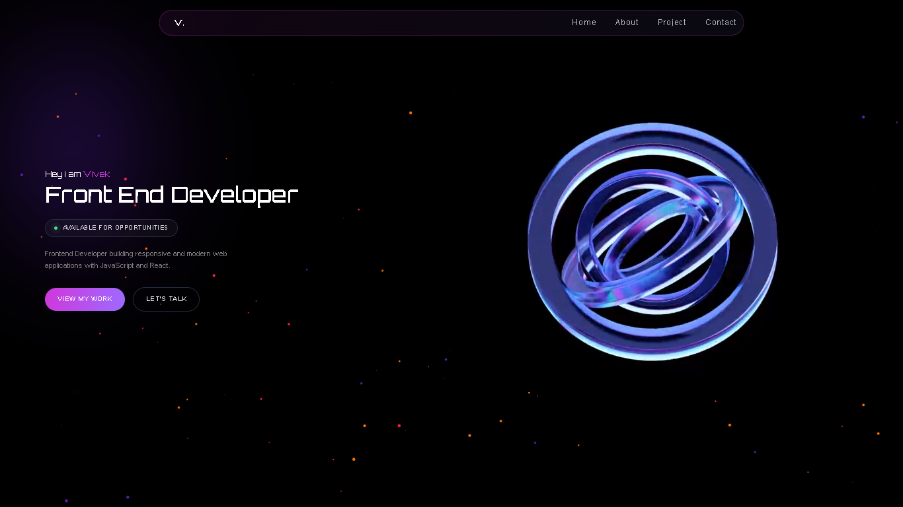

# Personal Portfolio

My personal developer portfolio built with React and pure CSS. The goal of this project was to build a clean, fast portfolio from scratch without relying on heavy UI libraries or CSS frameworks.

🔗 **Live Site:** [itsvivekdev.netlify.app](https://itsvivekdev.netlify.app/)

---

## Preview

<!-- Replace this with a screenshot of your hero section -->

---

## What’s Inside

- **Component-based setup:** Broke the site down into reusable components to keep files small and maintainable.
- **Pure CSS:** Handcrafted responsive layouts using Flexbox, CSS Grid, and custom variables instead of Tailwind or component libraries.
- **Lenis Smooth Scroll:** Added smooth inertial scrolling via a dedicated custom hook without breaking native page behavior.
- **Lucide Icons:** Kept iconography clean and lightweight using Lucide React.
- **Responsive:** Tested across desktop, tablet, and mobile breakpoints.

---

## Tech Stack

- **Framework:** React + Vite
- **Styling:** Vanilla CSS
- **Icons:** Lucide React
- **Scroll:** Lenis (`@studio-freight/lenis`)
- **Hosting:** Netlify

---
